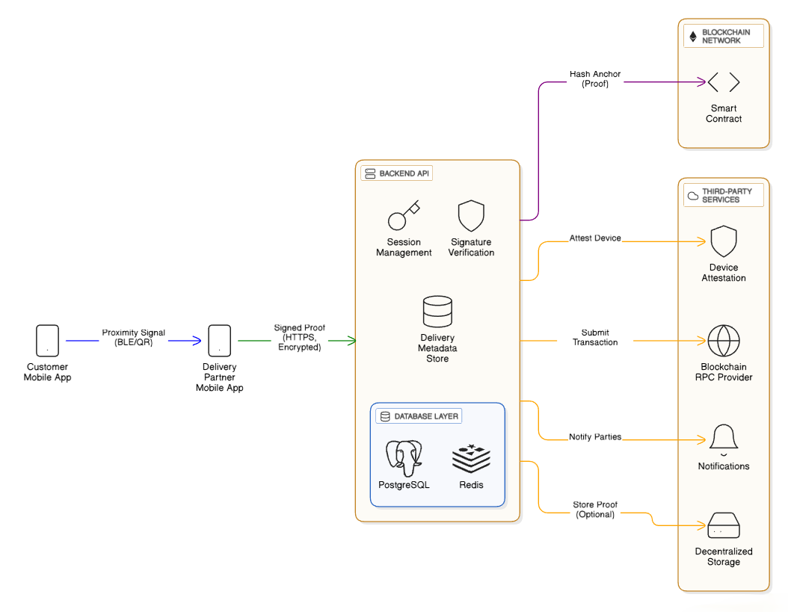

# Proximity‑Verified Delivery System — Full Solution Plan

## Overview

This project proposes a secure, scalable, and privacy‑preserving **last‑mile delivery confirmation system**. The system ensures that a delivery can only be marked complete when the delivery partner is **physically present at the customer’s location**, with **explicit customer participation**, and produces a **tamper‑resistant proof of delivery** anchored on a blockchain.

The solution is designed for real‑world logistics use cases, including high‑value and regulated goods, and is suitable for multi‑stakeholder ecosystems involving third‑party delivery partners.

---
## What We Are Building

We are building a secure last-mile delivery confirmation system where:

*Delivery can be completed only when the delivery partner is physically near the customer

*The customer actively participates (temporary proximity activation)

*Proof of delivery is tamper-resistant and auditable

*Blockchain is used only for immutable verification, not heavy computation

## System Components

### 1. Customer Mobile App

* Allows the customer to temporarily activate a delivery session
* Generates a short‑lived proximity signal (BLE or QR)
* Ensures explicit customer participation

### 2. Delivery Partner Mobile App

* Detects proximity signal only when physically nearby
* Performs cryptographic signing using hardware‑backed keys
* Submits delivery proof to backend

### 3. Backend Services (Cloud)

* Manages sessions, challenges, and verification
* Validates signatures and proximity tokens
* Stores delivery metadata
* Anchors proof hash to blockchain

### 4. Blockchain Smart Contract

* Stores immutable hash of delivery proof
* Enables auditability and dispute resolution
* No personal or location data stored on‑chain

### 5. Evidence Storage (Optional)

* IPFS or cloud storage for photos/documents
* Only content hashes are referenced

---

## Basic System Diagram

---

## End‑to‑End System Flow

1. Customer activates a short delivery window
2. System generates an ephemeral proximity token
3. Delivery partner arrives and detects token via BLE/QR
4. Backend issues a one‑time cryptographic challenge
5. Delivery partner signs proof using secure device keys
6. Backend verifies authenticity and validity
7. Delivery event hash is anchored on blockchain
8. Transaction hash becomes immutable Proof of Delivery

---

## Scalability & Fault Tolerance

### Handling Growth

* Stateless backend services allow horizontal scaling
* Redis used for short‑lived session tokens (TTL‑based)
* Blockchain anchoring is asynchronous
* Supports high‑volume delivery events

### Avoiding Failures

* Offline caching of signed delivery proofs
* Retry‑based anchoring using queues
* Delivery proof remains valid even if blockchain anchoring is delayed

### Cost Optimization

* Only hashes are stored on‑chain
* Supports Merkle‑tree batching for anchoring
* No GPS or large data stored on blockchain

---

## Security & Compliance

* Hardware‑backed key storage (Android Keystore / iOS Secure Enclave)
* Anti‑replay protection using nonces and short TTLs
* Device and app attestation support
* End‑to‑end encrypted communication
* Append‑only, tamper‑evident backend logs
* Privacy‑preserving design compliant with GDPR / DPDP Act

---

## Team Contributions

### Sanjay Singh Bungla  – System Architect

* Designed overall system architecture
* Defined threat model and security approach
* Designed blockchain anchoring strategy

### Digar Singh – Backend Engineer

* Designed APIs and session logic
* Implemented signature verification
* Planned database and scaling strategy

### Pranav Maheshwari – Blockchain Engineer

* Developed smart contract for proof anchoring
* Optimized on‑chain data usage
* Integrated blockchain with backend

### Ayaan Usmani – Mobile / UX Engineer

* Designed customer and delivery partner app flows
* Implemented proximity logic (BLE / QR)
* Focused on usability and consent flows

---

## Evaluation Focus

This solution emphasizes:

* Clear system design and data flow
* Strong security and privacy guarantees
* Scalability for real‑world logistics
* Objective, verifiable proof of delivery
* Clear ownership and teamwork

---
